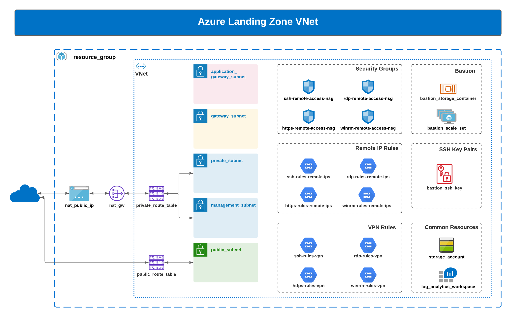

# AZURE Landing Zone

## Introduction

The purpose of the Azure Landing Zone Terraform is to create a customer landing zone, targeting Microsoft Azure.

This automation will create a Resource Group, KeyVault, KeyVault certificate, StorageAccount, LogAnalyticsWorkspace, network resources.
It also create the remote administration resources.
These resource can be integrated into a spoke-and-hub network model later if needed.

This  automation handles deploying a resource group and
few common Azure resources like KeyVault and KeyVault certificate in it

Please note that if you are managing your own SSL certificate, then you need to pass its data
and password in **PFX format** as input to this layer which will be stored in keyvault.
You can convert your SSL certificate of PEM format to PFX format using below command :

```bash
openssl pkcs12 -export -in yourCert.pem -inkey yourPrivateKey.pem \
-passout pass:yourCertPasswordforOutputFile -passin pass:yourCertPasswordforInputFile | base64 -w 0
```

## Prerequisites and Dependencies

- Configure TF Azure Provider(subscription id, client id, client secret, tenant id) is required to deploy the environments in this automation.
- If SSL certificate is managed by customer, then PFX certificate data and password needs to be handy
- A CIDR block is required for the creation of the VNet.

## Architecture Digram




#### Input Variables

| Variable Name        | Default           | Description                                                                  |
| :------------------- | :---------------- | :--------------------------------------------------------------------------- |
| client_code          | null              | Unique client code to be used for resource creation like bucket name         |
| environment          | prod              | Environment name, you can choose name from options dev, test and prod        |
| owner                | Unknown           | UserName of the Deployer                                                     |
| product              | landing-zone      | Product Name that is being deployed                                          |
| project              | lz                | Project code used for naming resources                                       |
| prefix               | ""                | Override for resource prefix naming                                          |
| location             | eastus            | Location                                                                     |
| certificate_data     | dummyCertData     | PFX SSL certificate data. Defaults to a pregenerated dummy cert data         |
| certificate_password | dummyCertPassword | PFX SSL certificate password. Defaults to a pregenerated dummy cert password |

#### Output Variables

| Variables                              | Example Output |
| :------------------------------------- | :------------- |
| resource_group_id                      | redacted       |
| resource_group_name                    | redacted       |
| resource_group_location                | redacted       |
| keyvault_id                            | redacted       |
| keyvault_uri                           | redacted       |
| keyvault_name                          | redacted       |
| keyvault_certificate_name              | redacted       |
| keyvault_certificate_id                | redacted       |
| keyvault_certificate_secret_id         | redacted       |
| keyvault_managed_identity_id           | redacted       |
| keyvault_managed_identity_principal_id | redacted       |
| storage_account_name                   | redacted       |
| storage_account_id                     | redacted       |
| storage_account_primary_blob_endpoint  | redacted       |
| log_analytics_workspace_name           | redacted       |
| log_analytics_workspace_id             | redacted       |
| gateway_subnet_cidr                    | redacted       |
| gateway_subnet_id                      | redacted       |
| gateway_subnet_name                    | redacted       |
| application_gateway_subnet_cidr        | redacted       |
| application_gateway_subnet_id          | redacted       |
| application_gateway_subnet_name        | redacted       |
| firewall_subnet_cidr                   | redacted       |
| firewall_subnet_id                     | redacted       |
| firewall_subnet_name                   | redacted       |
| management_subnet_cidr                 | redacted       |
| management_subnet_id                   | redacted       |
| management_subnet_name                 | redacted       |
| private_route_table_name               | redacted       |
| private_route_table_id                 | redacted       |
| private_subnet_cidr                    | redacted       |
| private_subnet_id                      | redacted       |
| private_subnet_name                    | redacted       |
| public_route_table_id                  | redacted       |
| public_subnet_cidr                     | redacted       |
| public_subnet_id                       | redacted       |
| public_subnet_name                     | redacted       |
| vnet_cidr                              | redacted       |
| vnet_id                                | redacted       |
| vnet_location                          | redacted       |
| vnet_name                              | redacted       |
| bastion_private_key                    | redacted       |
| bastion_scale_set_id                   | redacted       |
| bastion_storage_account_id             | redacted       |
| bastion_storage_container_id           | redacted       |
| https_remote_access_nsg_id             | redacted       |
| rdp_remote_access_nsg_id               | redacted       |
| ssh_remote_access_nsg_id               | redacted       |
| winrm_remote_access_nsg                | redacted       |
| https_remote_access_nsg_name           | redacted       |
| nat_gateway_id                         | redacted       |
| nat_public_ip                          | redacted       |
|                                        |                |

### Deployment Instructions

```
    terraform init
    terraform plan
    terraform deploy
```
